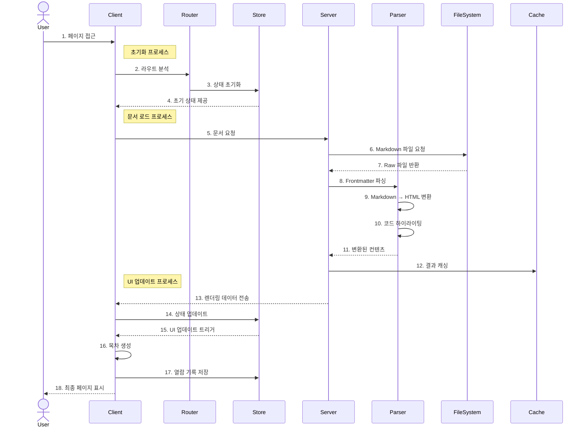

# Nimkoes Tech Blog

IntelliJ 스타일의 모던한 기술 블로그입니다. 마크다운으로 작성된 기술 문서를 웹에서 편리하게 볼 수 있도록 구현된 Next.js 기반의 정적 블로그 프로젝트입니다.

## 📚 프로젝트 개요

이 블로그는 개발자들이 익숙한 IDE 스타일의 인터페이스를 제공하여, 기술 문서를 보다 편안하게 읽을 수 있는 환경을 제공합니다. 특히 다크 테마와 코드 하이라이팅, 직관적인 네비게이션 등을 통해 개발자 친화적인 읽기 경험을 제공합니다.

### 동작 과정

#### 간단한 버전


#### 상세 버전


### 주요 기능
- 폴더 구조의 카테고리 탐색
- 문서 제목 검색 기능
- 문서 태그 검색 기능
- 열람 기록 저장
- 스크롤 이동 (목차 기반 이동, 최상단 이동)
- 반응형 디자인
- 이미지 팝업 뷰어
- 마크다운 렌더링
- 문서 목차 자동 생성

## 🛠 기술 스택

### Frontend
- Next.js 14 (App Router)
- TypeScript
- SCSS Modules
- font
    - JetBrains Mono (주 폰트)
    - Fira Code, Consolas, Menlo (대체 폰트)

### Markdown Processing
- Remark
- Rehype
- Gray Matter
- Highlight.js

## 🚀 시작하기

### 사전 요구사항
- Node.js 18.0.0 이상
- npm 또는 yarn

### 설치 방법

1. 저장소 클론
```bash
git clone https://github.com/your-username/tech-blog.git
cd tech-blog
```

2. 의존성 설치
```bash
npm install
# 또는
yarn install
```

3. 환경 변수 설정
`.env.local` 파일을 생성하고 다음 변수들을 설정합니다:
```env
NEXT_PUBLIC_GA_ID=your-google-analytics-id
NEXT_PUBLIC_KAKAO_ADFIT_ID=your-kakao-adfit-id
NEXT_PUBLIC_GOOGLE_ADSENSE_ID=your-google-adsense-id
```

4. 개발 서버 실행
```bash
npm run dev
# 또는
yarn dev
```

5. 빌드 및 프로덕션 실행
```bash
npm run build
npm run start
# 또는
yarn build
yarn start
```

### 문서 작성 방법

1. `public/resources` 디렉토리에 마크다운 파일을 생성합니다.
2. 파일 상단에 다음과 같은 frontmatter를 추가합니다:
```markdown
---
title: 문서 제목
description: 문서 설명
author: 작성자
date: YYYY-MM-DD
---
```

## 📱 반응형 디자인

- Desktop (1024px 이상)
- Tablet (768px ~ 1024px)
- Mobile (768px 미만)

각 디바이스 환경에 최적화된 UI/UX를 제공합니다.

## 📝 라이선스

이 프로젝트는 MIT 라이선스 하에 있습니다. 자세한 내용은 [LICENSE](LICENSE) 파일을 참조하세요.

## 🤝 기여하기

버그 리포트, 기능 제안, 풀 리퀘스트 등 모든 기여를 환영합니다. 

